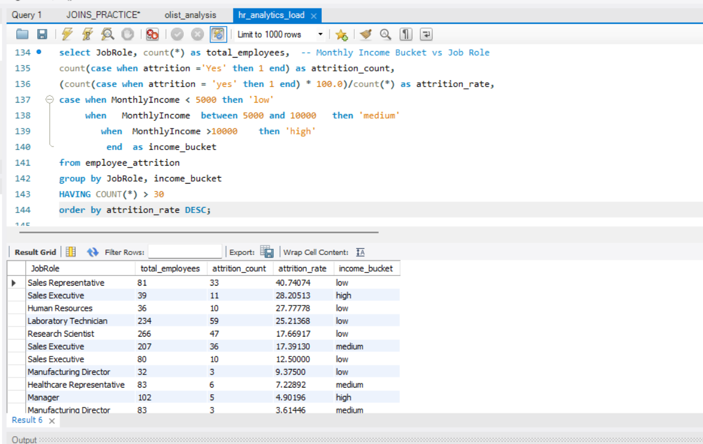
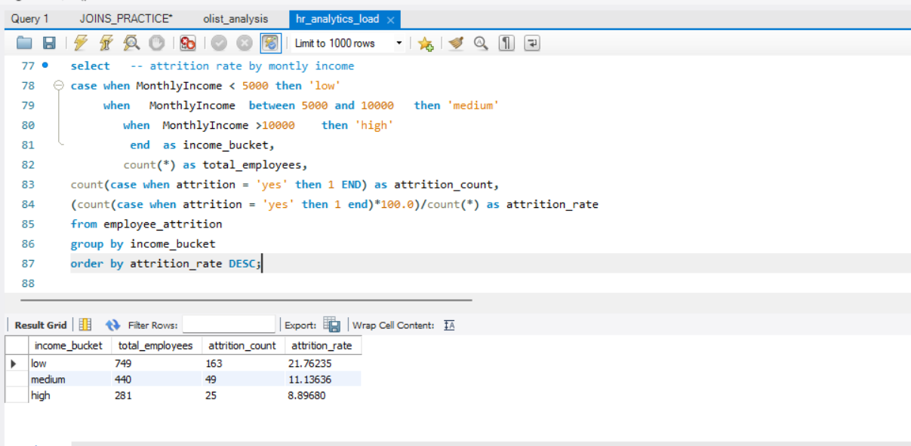

## HR Attrition Analysis Project

**Project Overview**

This project focuses on analyzing employee attrition patterns to help the HR department identify high-risk groups. By using SQL for data categorization and Power BI for visualization, I identified key factors like Overtime and Job Satisfaction that contribute to turnover.

Tools Used

**SQL (MySQL)**: Data ingestion, cleaning, and creating income/tenure buckets using CASE statements.

**Power BI**: Data modeling and creating interactive dashboards.

**Key Insights**
- Employees working Overtime have a significantly higher attrition rate.

- Lower Job Satisfaction scores correlate with higher turnover in specific income buckets.
- 

Employee attrition is not driven by a single factor, but by the interaction of workload and dissatisfaction — employees working overtime with low job satisfaction show the highest attrition (~35–37%), making workload the most critical lever to reduce overall attrition across the organization

## SQL Analysis Insights

